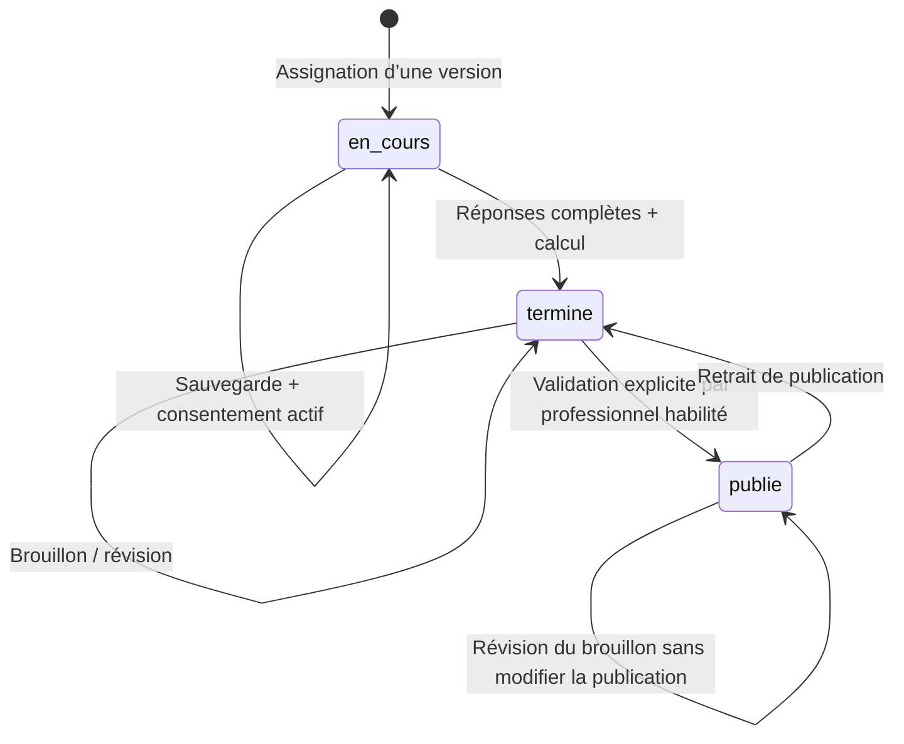

# Architecture et couverture

État documentaire actualisé le 1 octobre 2026 ; audit détaillé dans [SPEC-CONVERGENCE.md](SPEC-CONVERGENCE.md). Les validations historiques restent datées ci-dessous.

## Périmètre

Le document d’audit est utilisé comme description des besoins, pas comme une source de commandes à exécuter. L’application est reconstruite avec Laravel ; aucun ancien code Base44 ni aucune donnée personnelle historique n’a été importé.

Interface Blade responsive, assets locaux sans CDN, sessions Laravel et contrôleurs serveur. `TenantModel` applique un scope de cabinet aux objets métier. En requête web sans identité, ce scope ne retourne aucune donnée. Les commandes d’administration sont locales et ne passent pas par une API publique.

## Droits

| Fonction | Administrateur | Psychologue | Conseiller | Patient | Entreprise |
|---|---|---|---|---|---|
| Dossiers du cabinet, assignation | Oui | Oui | Oui | Son dossier en lecture | Non |
| Notes cliniques | Oui | Oui | Non | Non | Non |
| Réponses / résultats non publiés | Oui | Oui | Oui | Ses réponses ; scores après publication | Non |
| Modifier sa passation en cours | Non | Non | Non | Oui avec consentement | Non |
| Réviser / publier / dépublier | Oui | Oui | Non | Non | Non |
| Créer une version de questionnaire | Oui | Oui | Non | Non | Non |
| Messages | Ses échanges | Ses échanges | Ses échanges | Avec les professionnels | Avec les professionnels |
| Documents | Cabinet | Cabinet | Cabinet | Ceux partagés avec lui | Ceux partagés avec son organisation |
| Espace de travail | Personnel | Personnel | Personnel | Non | Non |
| Comptes et identité cabinet | Oui | Non | Non | Non | Non |

L’administrateur a ici un rôle métier de responsable du cabinet : il dispose donc de l’accès clinique. Créer un rôle d’administrateur purement technique nécessiterait une politique distincte. Aucun dossier n’est automatiquement associé à un compte par simple rapprochement d’e-mail.

Les employés d’une organisation ne donnent **pas** accès à leurs évaluations au portail entreprise. Un document d’entreprise doit être rattaché uniquement à l’organisation, sans `client_id`.

## Modèle

- `Tenant`, `User`, `Organization`, `Client` : cabinet, identités d’accès, partenaires, dossiers.
- `UserInvitation`, `LocalMail`, `PrivacyRequest` : invitations à usage unique, boîte de test chiffrée, demandes et réponses relatives aux droits.
- `Consent` : texte, version, acceptation, retrait. Le retrait ne supprime pas les données historiques.
- `AssessmentDefinition` : famille UUID, version, type, questions, dimensions et règles associées, version de moteur.
- `Assessment` : référence à une ligne de définition versionnée, réponses et résultat instantané chiffrés, dates et statut. Le parcours HTTP crée de nouvelles versions ; le modèle/base ne bloque pas une mise à jour interne de la ligne historique.
- `Interpretation` : draft courant, published_content validé/publié et ai_generations chiffré séparé. Chaque nouvelle génération conserve sa sortie originale intégrale, ses messages d’entrée et métadonnées ; une révision humaine ou régénération ne remplace plus l’original. Les anciennes sorties non conservées restent inconnues.
- `ClinicalNote`, `Appointment`, `Message`, `Document`, `Letter`, `WorkspaceDocument`, `Comparison`, `AuditLog` : suivi et traçabilité.

Les évaluations Gordon/Ennéagramme, tests personnalisés et questionnaires de besoins sont unifiés dans le modèle versionné. Les dimensions et scores sont des structures JSON versionnées dans la définition et le résultat ; ils ne sont pas dupliqués dans des tables `Dimension` ou `Score` séparées.

Clés étrangères et restrictions de suppression en base. Le scope cabinet et les contrôles de propriété s’exécutent côté Laravel : il ne s’agit **pas** de RLS native MySQL. L’archivage est réversible et désactive le compte patient. L’effacement définitif des contenus et l’anonymisation sont réservés à l’administrateur, après vérification du délai, de l’activité, des suspensions et d’une double confirmation.

## Transitions

La soumission verrouille le dossier et la passation dans une transaction ; le retrait de consentement verrouille le même dossier. Les sauvegardes navigateur sont sérialisées et attendues avant soumission. Une soumission répétée ou tardive reçoit HTTP 409. Aucun rôle ne contourne le verrouillage par la route de réponses : une nouvelle assignation conserve l’historique.

## Confidentialité

- Réponses, résultats, notes, messages, courriers, brouillons, comparaisons et fichiers chiffrés avec la clé d’application Laravel.
- Identité et coordonnées restent en clair en base pour le CRM ; archives de sauvegarde chiffrées par secretstream XChaCha20-Poly1305, clé distincte de l’APP_KEY. Le chiffrement du disque et une copie hors machine restent à organiser selon l’hébergement.
- Sessions chiffrées, cookie HttpOnly/SameSite, CSRF, limitation des tentatives de connexion, invalidation logique des comptes désactivés à chaque requête.
- HTML échappé par Blade. Markdown publié avec suppression du HTML brut et refus des liens dangereux.
- Fichiers sous `storage/app/private/vault`, noms de stockage aléatoires ; limites de type et taille. Téléchargement forcé, signature de cinq minutes et contrôle de rôle/propriété même avec la signature.
- Journal des consultations de dossiers et évaluations, mutations principales et téléchargements ; aucune réponse clinique enregistrée dans le journal. Ce journal applicatif n’est pas un journal inviolable externe.
- La publication copie le brouillon validé dans un champ distinct. Les modifications suivantes restent privées jusqu’à une nouvelle publication.

## Couverture et limites explicites

| Domaine de l’audit | Livraison |
|---|---|
| CRM, portails, questionnaires, suivi, consentement | Parcours opérationnels décrits dans le README |
| Gordon | Moteur et validation de grille opérationnels ; référentiel réel à importer |
| Ennéagramme / besoins | Structures opérationnelles ; textes originaux absents, démos étiquetées |
| IA d’interprétation | Adaptateur optionnel, appels simulés dans les tests ; intégration avec un fournisseur réel non validée |
| IA comparateur / conception / courriers | Travail manuel disponible ; automatisations IA spécialisées non implémentées |
| Graphiques | Barres, radars individuels/comparatifs et courbes chronologiques ; historique patient limité aux restitutions publiées |
| PDF individuel, courrier, comparaison | Exports réels avec identité et logo JPEG du cabinet, graphiques selon le rapport |
| Logo, pièces jointes aux courriers | Logo JPEG privé chiffré ; sélection de documents du même patient, PDF et annexes en ZIP |
| Google/Outlook, e-mail externe | Agenda et messagerie internes ; boîte locale de test opérationnelle pour les accès, SMTP à configurer plus tard selon le choix utilisateur. Aucune synchronisation calendrier externe |
| Conservation | Demandes, réponses, export, examen des activités, suspensions motivées et effacement confirmé des dossiers archivés éligibles |
| Sauvegardes et hébergement local | MySQL système, démarrage automatique, sauvegardes chiffrées quotidiennes et restauration testée ; copie hors machine à prévoir |
| Référentiels et validation clinique | Import prêt ; textes et autorisations authentiques restent à fournir par le cabinet |

Les restaurations de dossier ne réactivent pas silencieusement un accès : l’administrateur décide de réactiver le compte. La création de comptes, l’activation/désactivation, l’édition de rôle, les invitations et la récupération du mot de passe sont disponibles. Les messages d’accès passent par la boîte locale privée ; aucun fournisseur réel n’est configuré. Les sessions sont révoquées après modification des droits ou du mot de passe.

## Installation locale et hébergement Render + Aiven

Deux bases distinctes existent ; aucune synchronisation n’est implémentée :

- **Locale** : `.env` conserve MySQL système et les données de la démonstration. La préparation Aiven n’a pas remplacé cette configuration.
- **Aiven** : `.env.aiven` permet les opérations depuis cette machine sur MySQL distant. Les cinq migrations ont été appliquées : 28 tables. Le 29 septembre, un contrôle en lecture seule avec vérification du certificat TLS constate un cabinet, un compte utilisateur et aucun dossier patient. L’utilisateur a exécuté `cabinet:install --env=aiven` et signalé sa réussite. Le passage de relais utilisateur confirme ensuite une authentification administrateur et un tableau de bord fonctionnels en production ; ces deux actions n’ont pas été rejouées par l’agent.

Les paramètres `.env`, `.env.aiven`, `.env.render` et le certificat sous `storage/app/private` sont exclus de Git ; les fichiers d’environnement et fichiers privés sont aussi exclus du contexte Docker. Aucune clé ni aucun mot de passe ne doit être ajouté aux documents ou au dépôt. La clé APP_KEY préparée pour Render est conservée pour permettre le déchiffrement ; elle n’est pas régénérée au démarrage.

### Ce qui est implémenté pour Render

- `render.yaml` décrit un service web Docker, plan `free`, branche `main`, région `frankfurt`, contrôle de santé `/up` et paramètres secrets à renseigner.
- `docker/entrypoint.sh` adapte Apache à `PORT`, utilise `RENDER_EXTERNAL_URL` lorsque `APP_URL` est absent et décode `AIVEN_CA_BASE64` dans un fichier privé. Il vérifie que le certificat est lisible et fournit son chemin à PDO via `MYSQL_ATTR_SSL_CA`.
- La configuration prévoit des sessions chiffrées en base, un cookie sécurisé, le cache en base et les journaux sur stderr. L’IA est désactivée dans le Blueprint.
- Les migrations et la création du cabinet restent des opérations explicites. Aucun import de dossiers locaux ni création de comptes de démonstration n’est effectué au démarrage du conteneur.

### État du déploiement vérifié le 29 septembre 2026

Le site [Render](https://app-007-psychoevaluation.onrender.com) répond : `/up` et `/connexion` renvoient HTTP 200, et `/` conduit à la connexion. Les fichiers `/assets/app.css` et `/assets/app.js` sont accessibles en HTTPS (HTTP 200) et leurs empreintes correspondent aux fichiers du dépôt. La page publique référence la CSS par un chemin relatif, résolu en HTTPS. Elle ne charge pas le JavaScript du tableau de bord : son exécution et le HTML authentifié en production restent à contrôler dans un navigateur.

Le relais utilisateur confirme le déploiement, la connexion Render → Aiven chiffrée après remplacement du certificat CA, puis la connexion administrateur et le tableau de bord. Le certificat local a l’empreinte SHA-256 PEM annoncée dans ce relais. Ces contrôles manuels sont distingués des requêtes publiques et tests locaux exécutés par l’agent. La branche GitHub `main` a été vérifiée à `d277679` avant le présent nettoyage. L’image Docker n’a pas été reconstruite localement.

La correction `trustProxies(at: '*')` dans `bootstrap/app.php` est conservée. [Laravel 13 documente cette configuration](https://laravel.com/docs/13.x/requests#configuring-trusted-proxies) pour les proxys cloud dont les adresses ne sont pas connues ; [Render termine le TLS et transmet en HTTP](https://render.com/docs/web-services#connecting-from-the-public-internet). Les en-têtes transmis permettent à Laravel de reconnaître HTTPS. Les tests simulent cette traversée pour le tableau de bord et un téléchargement signé, et couvrent aussi HTTP local. Le joker suppose une entrée réseau de confiance ; il ne protège pas un serveur d’origine exposé directement à des en-têtes transmis arbitraires. Cette configuration est à réexaminer en cas de changement d’hébergement.

Le bloc temporaire `RENDER TLS DIAGNOSTIC` est retiré de l’entrypoint. Le décodage du CA, sa validation OpenSSL et `MYSQL_ATTR_SSL_CA` sont conservés. Aucune configuration TLS Aiven ni architecture fonctionnelle n’est modifiée.

**Historique du cookie :** `Secure` manquait lors du contrôle du 29 septembre. Après modification utilisateur, le diagnostic HTTP suivant a confirmé cet attribut actif. Le Blueprint seul ne prouve pas la configuration effective d’un service créé manuellement.

### Ce qui reste pour valider complètement la production

1. **Configuration et recette** : conserver l’attribut `Secure` constaté, contrôler les paramètres effectifs Render (`APP_ENV=production`, `APP_DEBUG=false`, `APP_URL` HTTPS), puis vérifier les assets du tableau de bord connecté, les sessions, permissions, PDF et liens signés sur le site. Le nettoyage de l’entrypoint doit encore être publié et déployé.
2. **Documents persistants** : choisir et intégrer un stockage privé durable. Les opérations documentaires utilisent encore `Storage::disk('local')` ; la configuration S3 seule ne constitue pas une intégration. Render gratuit ne conserve pas les fichiers locaux aux redémarrages. Ne pas y déposer de documents à conserver dans cet état.
3. **Exploitation distante** : définir et tester la sauvegarde/restauration de la base Aiven, du futur stockage documentaire et des clés. La crontab locale sauvegarde la base définie dans `.env`, pas automatiquement celle de `.env.aiven`. Aucun planificateur ni worker distant n’est attesté.
4. **Recette visuelle** : contrôler les parcours ordinateur/mobile et l’auto-sauvegarde dans un navigateur ; aucun test E2E ni test de charge réalisé.
5. **Questionnaires réels** : obtenir les textes, grilles et autorisations nécessaires puis valider leur import. Les contenus de démonstration ne sont pas des référentiels validés.

### Éléments reportés ou non implémentés

- Fournisseur IA réel et aides IA spécialisées aux courriers, comparaisons et questions : activation reportée pendant la préparation de l’hébergement.
- E-mails externes : configuration reportée par l’utilisateur. La boîte de test est limitée à local/testing ; elle ne fonctionnera pas avec `APP_ENV=production`. Le transport SMTP générique existe mais n’a pas été testé avec un fournisseur et les restrictions réseau de Render gratuit nécessitent une solution adaptée.
- Synchronisation Google/Outlook et synchronisation des bases locale/distante : non implémentées.
- Copie des sauvegardes hors machine, audit externe et validation clinique : non réalisés. Les tests techniques ne constituent pas une certification.

## Écarts de convergence observés le 1 octobre 2026

Le Spec Kit 001–018 a été retrouvé dans une copie externe identifiée dans [SPEC-CONVERGENCE.md](SPEC-CONVERGENCE.md), pas dans le dépôt Laravel. [ROADMAP.md](../ROADMAP.md) et [TRACEABILITY.md](../TRACEABILITY.md) sont établis à partir du code, des tâches source et des tests existants. Aucun comportement fonctionnel changé.

- Organisations : création/lecture ; édition et suppression non implémentées. Notes cliniques : création/lecture ; édition/suppression individuelle absentes, hors effacement global du dossier.
- Ennéagramme : neuf échelles auto-déclarées, sans migration/lecture des deux structures historiques ni sélection de type dominant ; décisions et sources métier manquantes.
- Besoins : démo 5 domaines + 22 échelles, sans explications/cas spécifiques par situation ; schéma générique personnalisable, pas référentiel validé.
- Portail patient : seules les six dernières passations sont affichées au dashboard, sans liste complète accessible au patient. Les URLs connues conservent leur contrôle de propriété.
- Audit : créations, dossiers consultés, publications et opérations documentaires couverts ; authentification, acceptation/renvoi d’invitation et changement de mot de passe n’émettent pas tous un événement métier. La nouvelle suite 009 vérifie l’audit de génération IA ; les autres événements restent sans assertions dédiées.
- Rétention : mécanique de dossier Client testée, mais décision métier de durée et conservation des documents entreprise/non rattachés non attestées. Le journal n’est pas inviolable ; l’audit de convergence ne constitue pas un audit externe de sécurité.

Disponibilité : après l’incident Aiven `Powered off` rapporté le 1 octobre, `/up`, `/connexion` et les deux assets répondent à nouveau HTTP 200 pendant l’audit. `/up` peut réussir même si la base est indisponible. Aucune authentification administrateur ni vérification TLS Render → Aiven rejouée dans cette mission ; les validations antérieures restent des preuves historiques, pas une garantie de disponibilité continue.

## Feature 009 — historique des générations IA

Correction ciblée depuis la baseline e71138c, sans changement des méthodes de révision/publication 010. Une colonne nullable LONGTEXT ajoutée par `2026_10_01_160120_add_ai_generations_to_interpretations_table.php` est castée encrypted:array dans Interpretation et exclue de sa sérialisation générique. Aucun nouveau modèle, relation ou endpoint.

Chaque génération réussie ajoute UUID, date d’enregistrement, demandeur, contenu original, modèle demandé/retourné si disponible, identifiant réponse si disponible, version du prompt, messages exacts envoyés et snapshot expurgé des réponses libres. Aucune clé API ou configuration secrète n’est copiée. Le verrou transactionnel Assessment existant sérialise les écritures ; l’audit interpretation.generee reste dans la même transaction. Le brouillon conserve sa limite de 50000 caractères, l’original reste intégral.

La régénération garde le comportement existant de remplacement du brouillon courant ; elle ajoute son original à l’historique sans changer la publication, sa date ou son validateur. La spec ne définit pas davantage de politique métier : pas d’historique de toutes les éditions humaines, pas de nouvelle durée de rétention et pas de restauration automatique d’un brouillon. La suppression de l’Interpretation par Retention supprime également cet historique. La liste chiffrée est adaptée au périmètre actuel ; elle croît avec les générations et n’est pas un journal SQL inviolable.

Une section de lecture échappée dans l’évaluation est réservée aux admin/psychologues. Les portails patient/entreprise, le conseiller et les exports patient ne reçoivent pas cet historique. Aucun score ni règle psychométrique n’est modifié.

Données anciennes : aucune copie du draft vers un prétendu original. Colonne null jusqu’à une génération effectivement enregistrée. Migration testée sur une ligne préexistante SQLite, pas appliquée à Aiven ; à appliquer via le processus de déploiement avant utilisation de la génération mise à jour. Un rollback de cette migration détruirait uniquement la nouvelle colonne et son historique : conserver le schéma et les données pour un retour de code, ne pas lancer un rollback de données sans sauvegarde.

Statut 009 PARTIAL : workflow interne testé avec réponses simulées ; **fournisseur OpenAI réel NON TESTÉ / BLOQUÉ faute de crédits API**. Aucune clé demandée, aucun appel IA réel. Validation fournisseur ultérieure séparée, hors suite automatisée gratuite.

## Feature 019 — P0 + PatientAI v0.1 (2 octobre 2026)

### Décisions P0 appliquées

- Propriété persistée : `tenant_id` + `user_id` patient + `client_id`. Identifiants imposés depuis la session et `User::client()`, jamais depuis le texte ou les paramètres de création. UUID public pour les conversations. Le scope tenant est complété par les contrôles du propriétaire sur chaque route. Les professionnels et entreprises n'accèdent pas au chat.
- Activation : `PATIENT_AI_ENABLED=false` par défaut. Accord distinct explicite à chaque création, avec texte, version `patientai-v0.1` et date persistés. Le consentement psychométrique n'est ni réutilisé ni modifié. Un compte inactif est rejeté par ActiveAccount ; un patient sans dossier actif associé est refusé.
- Confidentialité : tous les contenus de messages sont castés `encrypted`, stockés en LONGTEXT. L'accord est un texte public versionné ; aucun titre libre sensible. Le champ `content` est exclu des anciennes saisies flashées après validation. Aucun texte du chat ni exception provider n'est rapporté dans les logs/audit.
- Rétention : 30 jours configurables (`PATIENT_AI_RETENTION_DAYS`, minimum effectif 1), à compter de `updated_at` de la conversation : création, échange réussi ou retrait sous suspension. Une simple lecture ne prolonge pas la conservation. Les conversations expirées sont refusées (410), mais supprimables depuis la liste et exportables jusqu'à purge. `patientai:purge` est planifié quotidiennement, fuseau du cabinet configuré ; il passe explicitement chaque tenant au service et respecte `Client.retention_hold`, y compris sur les dossiers archivés.
- Effacement : suppression patient immédiate avec cascade des messages. Sous suspension, retrait de l'accord (`withdrawn`) sans destruction ; les nouveaux messages sont bloqués (409). Après levée de la suspension, suppression possible. L'anonymisation du dossier via Retention efface aussi toutes ses conversations dans la transaction existante. Les sauvegardes historiques gardent leur propre délai.
- Export : `PrivacyController::export` ajoute `patientai_conversations` avec accord, statut et messages déchiffrés dans l'export des droits existant, selon ses autorisations actuelles (patient propriétaire/professionnels habilités par Access). Aucune nouvelle lecture professionnelle du chat. Export et effacement du dossier restent opérationnels quand le feature flag est OFF.
- Audit : création, échange réussi, suppression ou retrait sous suspension ; seulement action, cabinet, acteur, type et identifiant d'entité. La purge console affiche uniquement un nombre agrégé. Les échanges PatientAI ne prolongent pas le délai de conservation du dossier clinique : cycle indépendant, avec effacement global lors de l'anonymisation.
- Limites : 2000 caractères/message et 10 requêtes de création/envoi par minute par tenant/utilisateur, configurables ; quota partagé entre conversations. Validation habituelle Laravel ; 429 au dépassement. Historique paginé : 20 conversations et 40 messages, pagination des messages les plus récents en premier, affichage chronologique dans chaque page.
- Erreurs : un échange écrit atomiquement les deux messages et son audit. Provider invalide, vide ou en panne : rollback, erreur générique et aucune saisie sensible flashée. Aucun appel à un provider alternatif.
- Async : aucun job ni contexte patient asynchrone en v0.1. Toute future exécution patient devra transporter tenant/user/client, recharger l'identité active et revérifier propriété/accord au moment d'exécution ; le scope console seul ne suffit pas. La purge actuelle utilise un tenant explicite.

### Architecture et limites

`config/patientai.php`, `LlmProvider`, `ConversationIntentRouter`, `FakeLlmProvider`, `PatientAiChat`, `PatientAiLifecycle`, `AiConversation`, `AiMessage` et `PatientAiController`. Cinq routes nommées sous `/patient/assistant`, sessions/ActiveAccount/CSRF existants, page Blade et navigation conditionnelle, contenu échappé et bulles dédiées en CSS locale.

Le provider reçoit **uniquement une intention** (`greeting`, `courtesy`, `farewell`, `identity`, `capabilities`, `unknown`), aucun texte libre, historique, identifiant, modèle Eloquent, clé ou données métier. Le fake n'a aucun client HTTP/SQL et retourne des textes fixes ; le seul accès configuration est le contact public. Aucun provider distant n'est disponible. Les demandes inconnues reçoivent un fallback sans reprise du texte ni information interne.

Normalisation ASCII, minuscules, ponctuation remplacée par des espaces. Les formules du Spec sont reconnues intégralement ; variantes supplémentaires bornées : bjr, bonjor, bonjou, bon jour, bon soir, slt, mercii, svp, s'il vous plaît/s'il te plaît, à plus/à la prochaine, qui êtes-vous/tu es qui, que pouvez-vous faire/aidez-moi. Aucun rapprochement flou général ou analyse clinique. Une phrase composée non reconnue reçoit le fallback.

Migration additive `2026_10_02_073257_create_patientai_tables.php` : deux tables, contraintes étrangères, UUID unique, indexes de propriété/expiration et cascade messages. Rollback supprime les deux tables et leur contenu. Migration validée dans les tests SQLite, **non appliquée en base applicative/Aiven**. Appliquer avant utilisation des parcours droits mis à jour ; aucune migration automatique au démarrage.

Factories et seeders de fixtures isolées disponibles uniquement pour démonstration locale/tests ; seeders non enregistrés dans le seeder principal et jamais exécutés par cette mission. Leur accord fictif ne constitue pas un accord utilisateur réel.

P0 + v0.1 uniquement. Pas de PromptRegistry/SafetyPolicy v0.2, contexte v0.3, outils métier, guide indexé, résultats, rendez-vous, RAG ou mémoire résumée. La persistance visible est un historique de chat, jamais une note clinique ou une mémoire injectée au provider. Recette visuelle/E2E, MySQL/concurrence et déploiement restent à vérifier. La purge automatique en hébergement nécessite un scheduler effectif ; aucun scheduler distant n'est attesté.

## Feature 019 — PatientAI v0.2 : prompt et politique (2 octobre 2026)

`PromptRegistry::CURRENT_VERSION = patientai-v0.2`. `get(version)` fournit une définition contrôlée (version, instructions, réponses, motifs de refus) ; toute version inconnue échoue explicitement. `response(category, version)` utilise cette définition. Aucun prompt dispersé dans contrôleurs/vues, aucun endpoint d'extraction du prompt.

Les instructions définissent PatientAI comme assistant numérique pour l'utilisation autorisée d'APP-007, ni psychologue, ni médecin, ni substitut au professionnel. Elles excluent diagnostic, invention, choix des réponses, manipulation/interprétation de scores sans mécanisme autorisé, accès aux informations professionnelles privées, secrets et élévation de droits déclarative.

`SafetyPolicy` normalise le message avec le routeur v0.1 et applique des règles bornées avant le provider. Priorité : demandes internes/contournement/usurpation, manipulation de score/profil, choix/réponse au questionnaire, diagnostic. Les refus sont générés côté serveur à partir du registre, sans appel au provider, et stockés chiffrés comme les réponses habituelles ; leur métadonnée `provider` vaut `policy` (sinon `fake`). Les noms publics pour les affirmations d'identité viennent de la configuration, sans Joshua hardcodé dans la logique. Un message ne modifie aucun droit Laravel.

Refus institutionnel : nom et rôle publics configurés en P0 ; à défaut, administrateur/responsable de la plateforme. Aucun chargement automatique de coordonnées privées. Le fallback indique explicitement l'absence d'accès à l'information, sans inventer résultat, rendez-vous, score ou donnée patient. Les salutations/remerciements/clôtures v0.1 sont conservés ; identité et capacités précisent les limites v0.2.

`FakeLlmProvider` délègue ses réponses au registre. Le contrat `LlmProvider::reply(string $intent): string` reste inchangé : aucune transmission du message libre, du prompt, de données métier ou de secrets. La politique ne fait aucun accès SQL/réseau. Les vérifications Client existantes sont uniquement celles de propriété/accord v0.1 ; aucun Client comme contexte conversationnel ni contexte v0.3 ajouté.

Aucune migration, modification des droits/consentement/rétention/export, dépendance, provider distant ou activation du flag. La version active est identifiable via le registre et le code Git ; elle n'est pas persistée par message dans le schéma v0.1 et aucune version n'est attribuée rétroactivement aux anciens messages. Le prompt texte est un contrat d'instructions ; le fake ne l'interprète pas avec un LLM, il utilise les réponses/règles déterministes du même registre.

Limites : règles lexicales françaises/anglaises simples, non exhaustives ; formulations ambiguës possibles et faux positifs possibles. Une demande non reconnue reçoit toujours le fallback sans données. Aucune garantie de reconnaissance universelle ou d'évaluation d'un fournisseur réel, aucun RAG, outil métier, mémoire ou développement v0.3+. Le hardening v1.0 reste distinct, malgré les refus et l'anti-usurpation de base demandés pour v0.2.

## Feature 019 — PatientAI v0.3 : contexte d'identité minimal (2 octobre 2026)

`PatientContext` est un DTO `final readonly`, sans modèle Eloquent ni relation, contenant exactement trois entiers : `userId`, `tenantId`, `clientId`. `owns(tenantId, userId, clientId)` vérifie simultanément les trois composantes. Aucun champ d'affichage n'est ajouté.

Flux : **session Laravel → User authentifié → PatientContextFactory → tenant + user + client → autorisation → PatientAiChat**. `fromAuthenticatedUser()` n'accepte ni User cible, ni identifiant, ni Request, ni message. Il relit User via auth()->id(), sélectionne seulement id/tenant_id/role/active, exige patient actif et cabinet existant via User::tenant(), puis résout User::client() avec tenant explicite, sélection id/tenant_id/user_id/anonymized_at et exclusion des dossiers archivés/anonymisés. Les relations déjà chargées sur l'identité de session ne sont pas utilisées. Tenant désigne le cabinet ; Organization est un partenaire, pas une identité patient alternative.

La factory est utilisée par tous les parcours du contrôleur PatientAI : liste, création, consultation, envoi et suppression. Les filtres de conversations comprennent explicitement tenant/user/client en plus du scope TenantModel. Les champs navigateur client_id/user_id/tenant_id/conversation_id/conversation_uuid/patient_id sont ignorés comme source d'identité. Une conversation désignée par UUID doit appartenir au contexte résolu ; changer la route ne change pas le patient. Aucun endpoint n'expose le contexte.

Dans les transactions de création/envoi/suppression, le contexte est résolu à nouveau avec `lockClient: true`, puis la conversation est rechargée et verrouillée avec les trois filtres de propriété. Le verrou Client conserve l'ordre Client → conversation. Pour la suppression, le seul attribut supplémentaire lu est retention_hold, utilisé par le cycle de vie existant et non ajouté au DTO. Le service d'envoi vérifie aussi le feature flag ; l'appel direct de l'orchestrateur reste soumis à la résolution d'identité et à la propriété.

**PatientContext serveur ≠ prompt/provider** : aucun des trois identifiants n'est transmis au FakeLlmProvider. Son contrat reste reply(intent) ; aucune nouvelle injection dans PromptRegistry patientai-v0.2 ou SafetyPolicy. Les affirmations du texte n'affectent pas le contexte et continuent à recevoir refus/fallback v0.2 selon les règles existantes.

Exclus du DTO et des requêtes de résolution : identité civile/contact, organisation partenaire, motif clinique, notes, réponses, scores, résultats, interprétations, documents, rendez-vous, messages professionnels, ai_generations et secrets. Aucune donnée métier d'évaluation n'est accessible par PatientContext. Les questions sur évaluations/scores/résultats restent au fallback d'absence d'accès. Les contrôles User/Client sont des lectures d'autorisation seulement ; l'interface générale existante conserve son affichage de compte/cabinet.

Aucune migration, stockage du DTO, cache/singleton de contexte, nouvelle route, outil v0.4, RAG, mémoire ou provider distant. Contexte valide au moment de résolution, à reconstruire à chaque exécution future ; aucune tâche patient async créée. ActiveAccount et la révocation de session existante restent en amont. Concurrence MySQL réelle et recette navigateur non validées ; aucun déploiement ni activation du flag.

## Feature 019 — PatientAI v0.4 : évaluations read-only (2 octobre 2026)

Flux : **PatientContext résolu serveur → PatientAssessmentTools → autorisation Laravel → DTO minimal → PatientAiChat/FakeLlmProvider**. Chaque outil reconstruit le contexte authentifié, sans accepter tenant/user/client cibles. Réutilisation de Assessment, AssessmentDefinition, Client et Interpretation, sans représentation métier parallèle.

`listMyAssessments(filters)` accepte uniquement status (en_cours/termine/publie), page (1–100) et limit (1–20, défaut 10), validés côté serveur ; ordre id décroissant, pagination bornée avec hasMore. Toute clé inconnue est rejetée. `getMyAssessmentStatus(uuid)` valide l’UUID puis recherche dans le même périmètre. UUID invalide, inconnu, étranger ou invisible donnent exactement le même résultat indisponible, sans détail d’existence.

Visibilité : tenant et Client du contexte, Client actif non anonymisé appartenant au User, définition du même tenant et statut connu. Le portail existant présente les évaluations en cours et terminées indépendamment de la publication des résultats : ces statuts sont donc visibles. Pour publie, exigence restrictive supplémentaire d’une Interpretation du même tenant avec published_at non nul ; aucun contenu d’interprétation n’est chargé. Les incohérences sont masquées. Traduction Laravel centralisée : en_cours → En cours, termine → À réviser, publie → Publié, conforme aux libellés existants.

`PatientAssessmentData` readonly contient exactement uuid, questionnaireName, status, statusLabel, url : identifier la passation, nommer son questionnaire, présenter son état réel et ouvrir la page autorisée. `PatientAssessmentResult` readonly contient items, hasMore, available. Aucun tenant/user/client, réponse, score, résultat, note, brouillon, génération privée, rendez-vous, modèle Eloquent ou secret ne passe au provider. Projection SQL limitée aux colonnes nécessaires et au nom de définition ; les relations sensibles servent uniquement aux prédicats de visibilité.

URL produite par Laravel via evaluations.show avec l’identifiant numérique existant ; jamais evaluations.index (professionnels), PDF ou route admin. URL affichée comme texte échappé dans la bulle existante. Migration additive 2026_10_02_082852_add_uuid_to_assessments_table : UUID unique nullable pour transition, backfill de toutes les lignes existantes sans modifier données métier/timestamps ; génération automatique pour toute création Eloquent. Clé primaire et routes numériques conservées. L’insertion SQL directe future doit fournir un UUID ; une ligne sans UUID reste masquée. Migration testée sur SQLite seulement, non appliquée en base applicative/Aiven.

Contrat provider étendu minimalement : reply(intent, ?PatientAssessmentResult), argument facultatif absent pour les intentions v0.1. Le fake n’a aucun accès DB/HTTP ; il rend le DTO via PatientAssessmentFormatter. L’orchestrateur exige l’égalité avec ce rendu Laravel déterministe : fabrication de statut/lien ou altération de réponse entraîne rollback. SafetyPolicy reste prioritaire. PromptRegistry active patientai-v0.4 avec capacités réelles ; patientai-v0.2 reste récupérable explicitement et ses règles de refus sont conservées.

Routage borné : « Quelles sont mes évaluations ? », « Montre-moi mes évaluations », « Mes évaluations », « Ai-je des évaluations en cours ? ». Statut : « Quel est le statut de mon évaluation [UUID] », « Statut de mon évaluation [UUID] », « Statut évaluation [UUID] », casse/accents et ponctuation terminale tolérés. Aucun UUID sélectionné implicitement ni identité tirée du texte ; sans UUID valide, réponse indisponible. Les filtres page/limit sont une API de service interne, pas une grammaire chat ni un nouvel endpoint navigateur. Demandes non reconnues : fallback. Salutations/refus ne chargent pas les évaluations.

Outils strictement read-only ; seules les écritures de conversation/audit déjà prévues persistent. Consentement, chiffrement, cycle de vie et limites conservés. Aucun v0.5, aide questionnaire, RAG, rendez-vous, résultat détaillé, mémoire ou action métier. Feature flag toujours OFF par défaut ; aucun OpenAI, provider distant ou réseau externe.

## Feature 019 — PatientAI v0.5 : guide local et aide questionnaire (2 octobre 2026)

`PatientGuideRegistry` sélectionne explicitement un seul document local : docs/patientai/knowledge/06-app007-functional-guide-patient.json. Le Markdown adjacent est son résumé lisible. Version exécutée `patient-guide-v0.5.1`, audience exactement PATIENT_PUBLIC, statut exactement APPROVED, source fixée dans le code et métadonnées d’approbation technique (audit code/vues/date) obligatoires. Toutes les rubriques et le vocabulaire sont validés et bornés ; document absent, mal formé, mauvaise version/audience/statut/source ou métadonnées absentes : aide indisponible. L’approbation est une décision éditoriale versionnée dans Git, sans workflow automatique ni certification clinique. Les deux autres Markdown restent des références non sélectionnées ; aucun glob, recherche vectorielle, indexation, RAG ou fetch réseau.

Guide : 14 rubriques exactes (compte, consentement, dashboard, passations, évaluations, questionnaires, résultats publiés, rendez-vous, messagerie, documents, confidentialité, droits, PatientAI, assistance), chacune avec provenance vers le code/vues audités. `PatientGuideData` contient topic, version, source, provenance, text, links, available. Une seule rubrique sélectionnée atteint le fake, pas le corpus. L’accès guide exige aussi un PatientContext valide. Les liens sont une correspondance Laravel allowlist : profile, dashboard, calendar.index, messages.index, documents.index, patientai.index uniquement si activé. Trois routes GET existantes sont nommées sans changement d’URL ni permission. Le contact d’assistance utilise uniquement nom/titre publics configurés, sans coordonnées privées.

Vérité patient constatée : profil avec identité en lecture et changement de mot de passe ; consentement psychométrique accepté/retiré depuis les écrans réels ; dashboard limité à six évaluations et cinq rendez-vous planifiés ; passations assignées accessibles individuellement. Calendrier en lecture seulement pour patient (ni création ni annulation) ; documents partagés en téléchargement seulement (ni dépôt ni fichiers professionnels) ; messagerie avec professionnels actifs du cabinet et marquage lu lors de l’ouverture ; profil avec export JSON et demandes de droits/suivi, sans effacement global automatique. Résultats/PDF seulement selon publication du workflow : le guide explique l’accès sans consulter les résultats. Les listes /evaluations et /questionnaires, la gestion /droits, administration, création/versionnement de questionnaires, notes, comparateur/courriers/espace de travail sont exclus des liens/capacités patient. Aucun canal d’assistance inventé. La page /guide préexistante est orientée professionnel et n’est pas utilisée comme source PatientAI.

`QuestionnaireHelpTool::getQuestionnaireHelp(assessmentUuid, questionId?)` : **session → PatientContext → requête d’évaluation autorisée v0.4 → passation en_cours + consentement psychométrique actif → définition/version réellement assignée → question exacte → DTO minimal**. La règle restrictive suit evaluations/show qui ne montre les champs du questionnaire que dans ces conditions. Le service partage les prédicats tenant/user/client/définition/visibilité de PatientAssessmentTools::authorizedQuery ; aucun identifiant cible accepté. UUID invalide/inconnu/étranger, passation inaccessible/terminée, consentement absent/retiré, question inexistante/mal formée : même DTO indisponible et même texte, sans détail d’existence.

La définition/version existante reste la source ; aucune famille/version parallèle ni sélection de dernière version. question_id suit la même grammaire que DefinitionController : lettre ASCII initiale puis lettres/chiffres/underscore, 40 caractères maximum, sensible à la casse. Correspondance unique dans les questions de cette définition ; identifiant d’une autre définition/version sans correspondance locale refusé. S’il existe le même identifiant dans plusieurs versions, seule la métadonnée de la version assignée est utilisée. Types/bornes/options revalidés avec les contraintes existantes ; clés supplémentaires ignorées. Les dimensions et calculs de scoring ne sont pas projetés.

DTO readonly QuestionnaireHelpData : available, assessmentUuid, questionnaireName, definitionVersion, isDemo, url, guideVersion, source, objective, instructions, navigation, vocabulary, question nullable. QuestionHelpData : id, instruction (libellé autorisé), type, required (incluant obligation métier Gordon/Ennéagramme), minimum/maximum uniquement pour scale, options uniquement pour choice. Aucun modèle, tenant/user/client, réponse actuelle/historique, score/calcul, résultat/profil, interprétation, note, brouillon, génération, rendez-vous/document ou secret. Sans question_id : informations générales et aucune question transmise. Seule la liste JSON de la définition assignée est lue côté serveur pour sélectionner la question ; aucune définition étrangère n’est chargée.

Objectif clinique/glossaire clinique absents du schéma actuel : explicitement non documentés, jamais déduits du nom/type. Glossaire approuvé limité à consigne/échelle/option. Le format explique Oui/Non, choix sans recommandation, entier entre bornes par pas de 1, texte libre 5000 caractères. La navigation explique la page unique avec défilement, retour aux champs avant soumission, Sauvegarder/reprise/sauvegarde automatique et verrouillage définitif ; aucun bouton précédent/suivant inventé. isDemo rappelle l’absence d’instrument validé.

Routage borné par formules explicites (tests couvrent les 14 rubriques). Aide : `Aide questionnaire UUID [question ID]`, `Aide pour mon questionnaire UUID [question ID]`, `Explique la consigne/l’échelle/le vocabulaire/la navigation UUID [question ID]`, `Que signifie l’échelle/ce mot UUID [question ID]`. L’UUID doit être fourni, pas extrait d’un historique ni d’une identité déclarée. Les demandes sans cible valide donnent l’aide indisponible ; variantes hors grammaire donnent le fallback. Les mots non documentés n’ont pas de définition inventée.

LlmProvider::reply conserve l’argument facultatif compatible v0.4 et accepte désormais l’union des trois DTO de résultat : PatientAssessmentResult, PatientGuideData, QuestionnaireHelpData. FakeLlmProvider délègue le rendu d’aide à PatientHelpFormatter sans DB/HTTP ; l’orchestrateur exige égalité exacte avec le rendu Laravel, rejetant invention de lien/fonction/réponse. PromptRegistry actif patientai-v0.5 ; versions v0.2 et v0.4 inchangées et récupérables explicitement. SafetyPolicy reste exécutée avant tout outil/provider et refuse choix/réponse à la place du patient, optimisation/prédiction de profil et interprétation psychologique de réponse ; reconnaissance lexicale volontairement bornée. Les instructions dans un texte documentaire/question restent des données citées, ne modifient jamais politique, identité, routage ou droits. Blade continue d’échapper les bulles.

Aucune migration v0.5, aucune lecture de résultats détaillés ou données rendez-vous par PatientAI, aucun outil v0.6, mémoire v0.8, RAG v0.9, provider distant ou écriture métier. Seuls messages chiffrés/audit de conversation préexistants persistent. Flag OFF, consentement et cycle export/effacement/rétention conservés. Migration UUID v0.4 toujours à appliquer selon procédure avant activation, jamais exécutée sur la base applicative par cette mission.

## Feature 019 — PatientAI v0.6 : rendez-vous read-only (2 octobre 2026)

Flux : **session Laravel → PatientContext → PatientAppointmentTools → tenant/user/client + visibilité + temps → PatientAppointmentResult → PatientAiChat/FakeLlmProvider**. Réutilisation du modèle Appointment existant, relation client et champs title/starts_at/duration/location/status ; aucun nouveau modèle métier, schéma ou identifiant parallèle. Appointment n’a ni UUID public, professionnel associé, notes internes, archive ni SoftDeletes : rien de tel n’est inventé ou transmis.

`listMyUpcomingAppointments()` et `getMyNextAppointment()` partagent exclusivement `upcoming(limit)` : identité reconstruite côté serveur, tenant/client explicites, Client du même tenant appartenant au User et ni archivé ni anonymisé ; statut exactement planifie, conformément aux prochains rendez-vous du dashboard. Annule/inconnu exclu. Le calendrier général peut aussi montrer passé/annulé ; PatientAI ne reprend pas cette liste générale pour répondre « à venir ». Aucun paramètre cible, filtre utilisateur, identifiant rendez-vous ou contexte textuel accepté. Liste bornée à 10, indicateur hasMore ; prochain limité au premier. Tri starts_at ASC puis id ASC pour départager deux créneaux identiques.

**Temps et fuseau** : config app.timezone (APP_TIMEZONE, défaut Africa/Kampala) est la seule source. User/Tenant ne possèdent pas de timezone. La colonne appointments.starts_at est DATETIME sans fuseau et sans fractions de seconde ; le formulaire professionnel datetime-local est validé puis stocké via Eloquent sans conversion explicite UTC. Le cast datetime et la vue calendrier utilisent le fuseau applicatif. Les outils préservent cette sémantique de date locale, sans supposer que les lignes sont stockées en UTC. CarbonImmutable::now(app.timezone)->startOfSecond() fournit la borne serveur ; WHERE starts_at >= cette borne Carbon, au format date DB Laravel. « Maintenant » est inclus à la seconde de stockage, moins une seconde exclu, plus une seconde inclus. Une séance commencée avant cette borne est exclue même si sa durée pourrait couvrir maintenant. Le dashboard préexistant utilise startOfDay ; le filtrage PatientAI est volontairement plus strict pour la demande « futur », sans modifier le dashboard.

Pour projection, starts_at brut est interprété explicitement avec CarbonImmutable::createFromFormat dans app.timezone ; DTO date ISO8601 avec offset, fuseau IANA, affichage français d/m/Y à H:i:s et offset UTC. Aucune comparaison de texte dans le provider ni décision temporelle client. Passage au lendemain Kampala depuis une horloge UTC et jour précédent New York testés ; offset été/hiver New York testés. Le stockage existant sans offset ne permet pas de distinguer les deux occurrences d’une heure civile répétée lors d’un changement d’heure. Un changement historique d’APP_TIMEZONE réinterpréterait les données locales existantes : aucune migration/normalisation de ce stockage n’est entreprise ici.

DTO readonly `PatientAppointmentData` exactement : title (libellé déjà visible au patient), startsAt (ISO8601), timezone, durationMinutes, location nullable, status (source DB, ici planifie). Aucun id, client/user/tenant, professionnel inventé, note, donnée clinique, score/profil/résultat/interprétation/génération privée ou modèle Eloquent. Enveloppe readonly `PatientAppointmentResult` : items, hasMore, calendarUrl. L’id sert uniquement au tri serveur et ne sort pas dans le DTO. Les requêtes projettent seulement les champs utiles ; aucune relation Client n’est hydratée pour produire la réponse. Un lieu absent devient « Lieu non renseigné », sans mode/professionnel supposé.

Lien unique produit par Laravel route(calendar.index), vers /calendrier accessible au patient : aucune page individuelle GET de rendez-vous n’existe, donc aucun lien individuel/action/admin inventé. `PatientAppointmentFormatter` traduit planifie en Planifié, garde date/heure/durée/lieu issus du DTO et affiche le fuseau. Liste vide/prochain absent : « Aucun rendez-vous à venir n’est actuellement disponible. » sans rendez-vous ni lien inventé. Si limite atteinte, orientation vers le calendrier réel avec indication d’autres rendez-vous.

Routage borné : « Quels sont mes prochains rendez-vous ? », « Montre-moi mes prochains rendez-vous », « Mes prochains rendez-vous », « Ai-je un rendez-vous prochainement ? », « Quand/Quel est mon prochain rendez-vous ? », « Mon prochain rendez-vous ». Les exemples de création/annulation/déplacement et variantes explicitement listées renvoient au guide approuvé appointments et à la messagerie, sans consulter les rendez-vous ni exécuter d’action. Le portail réserve création/annulation aux professionnels et n’offre pas de modification patient. Autres formulations : fallback, jamais confirmation simulée. SafetyPolicy reste prioritaire ; identité déclarée ou champs client_id/user_id/tenant_id n’altèrent jamais PatientContext.

LlmProvider conserve le second argument facultatif et ajoute PatientAppointmentResult à l’union existante, sans modifier les appels sociaux. FakeLlmProvider utilise le formatter sans DB/HTTP ; PatientAiChat exige l’égalité exacte au rendu Laravel, sinon rollback des messages/audit. Provider ne reçoit que le résultat autorisé, jamais requête/identité/Eloquent. PromptRegistry actif patientai-v0.6, versions v0.2/v0.4/v0.5 récupérables et inchangées ; capacités/instructions actualisées sans résultats détaillés. Guide local version patient-guide-v0.6.1 : seule correction factuelle de la phrase « PatientAI ne consulte pas l’agenda », désormais obsolète après livraison v0.6, et provenance de l’outil ajoutée ; aucune autre fonctionnalité guide anticipée.

Aucune route, vue, dépendance ou migration nouvelle ; Appointment jamais modifié par PatientAI. Seules les écritures chiffrées de conversation et audit préexistantes persistent. Flag OFF et cycle de vie/consentement/rate limiting conservés. Aucun v0.7, résultats détaillés, mémoire, RAG, action métier ou provider externe. Migration UUID v0.4 toujours non appliquée à la base applicative/Aiven par cette mission.

## Feature 019 — PatientAI v0.7 : résultat publié (2 octobre 2026)

Flux : **session → PatientContext → Assessment autorisée → tenant/Client propriétaire → publication effective → DTO minimal → faits publiés → explication PatientAI descriptive**. Modèles Assessment/AssessmentDefinition/Interpretation existants, casts chiffrés et prédicats PatientAssessmentTools réutilisés ; Scoring demeure la source des valeurs enregistrées, jamais appelé pour les recalculer par PatientAI.

`PatientPublishedResultTool::getMyPublishedResult(uuid)` reconstruit l’identité authentifiée, valide l’UUID, applique la propriété et la visibilité v0.4, exige status=publie. Le workflow réel publie en copiant draft vers published_content, renseignant published_at et passant l’assessment à publie ; dépublication efface published_at/published_content et revient à termine. L’outil exige aussi Interpretation du même tenant, liée à cette Assessment, published_at non nul et published_content non vide. Une simple fin de passation, présence de scores, Interpretation ou ai_generation ne vaut jamais publication. Ces critères suivent les résultats/PDF du portail ; les incohérences (notamment panneau restitution pouvant afficher seulement selon published_at dans la vue) sont traitées plus restrictivement, pas exploitées.

La lecture est transactionnelle avec lockForUpdate sur Assessment, même verrou que publier/dépublier, afin de garder un état cohérent pendant la projection. Aucun UPDATE métier. Seules les colonnes publiées de l’Interpretation sont sélectionnées : assessment_id/published_at/published_content, jamais draft, ai_generations, input_snapshot, prompt_version, model, reviewed_by ni notes. Définition du même tenant/version assignée ; métadonnées kind/definition_version du résultat, si présentes, doivent correspondre à cette définition. Les scores Gordon sont limités aux dimensions A/B/C/D existantes, ceux de l’Ennéagramme aux identifiants de la définition assignée. Valeurs numériques finies, maximum positif, valeurs entre 0 et maximum ; incohérences refusées sans conversion/correction. Types/valeurs numériques conservés tels que lus, sans pourcentage dérivé, nouveau profil ni moteur psychométrique.

DTO `PatientPublishedResultData` final readonly, exactement : available ; assessmentUuid (repérer la passation autorisée) ; questionnaireName et definitionVersion (définition liée) ; publishedAt (marqueur de publication, ISO8601) ; scores et maximum (valeurs visibles dans evaluations/results, aucun recalcul) ; method (libellé visible de results.method ou le même texte par défaut que la vue) ; publishedText (texte de published_content rendu lisible) ; isExcerpt (signaler un extrait) ; url (evaluations.show construite par Laravel) ; isDemo (avertissement de démonstration issu de la définition). Aucun tenant/user/client/modèle, réponse brute, profil supplémentaire, engine ou informations professionnelles internes. L’UUID n’accorde aucun droit. Un résultat textuel publié peut n’avoir aucun score ; ni les réponses brutes du résultat raw-v1 ni le champ answers d’Assessment ne sont transmis.

La colonne results est un conteneur encrypted:array : elle est déchiffrée côté Laravel uniquement après contrôle de publication, puis projetée sur les clés publiques autorisées. Le chiffrement empêche une projection SQL de ses clés internes ; des réponses peuvent exister dans ce conteneur raw-v1 mais sont immédiatement exclues du DTO. La colonne séparée answers n’est jamais sélectionnée. Les questions de la définition ne servent qu’à identifier les clés de scores autorisées, jamais transmises ni utilisées pour recalculer. ClinicalNote et audit interne ne sont jamais interrogés par l’outil.

Le texte publié suit le rendu Markdown sécurisé de la vue (html_input=strip, allow_unsafe_links=false), puis devient texte sans balises, entités décodées. Aucun fetch d’image ou lien. Le champ isDemo provient de AssessmentDefinition.is_demo et conserve l’avertissement patient : questionnaire de démonstration, sans validation psychométrique. Borne 4000 caractères ; isExcerpt avertit explicitement de l’extrait et pointe vers la publication intégrale. Aucun résumé clinique automatique, aucune modification de sens volontaire ; les ressources sans texte affichable sont indisponibles. Le DTO est un sous-ensemble de ce que le patient peut déjà voir, jamais enrichi d’un brouillon récent, ancien historique ou génération privée.

`PatientPublishedResultFormatter` expose deux sections observables : « Résultat publié — faits fournis par Laravel » (publication/version, scores/maxima exacts et restitution publiée) puis « Explication PatientAI — descriptive ». La seconde est déterministe, explique seulement l’origine des faits et le maximum affiché, sans nouveau diagnostic, cause, recommandation clinique, profil, prédiction ou validation professionnelle. Elle oriente vers le professionnel pour le sens clinique. FakeLlmProvider reçoit uniquement le DTO autorisé ; LlmProvider ajoute ce DTO à l’union facultative existante. PatientAiChat vérifie l’égalité exacte au formatter Laravel : toute fabrication/altération entraîne rollback. SafetyPolicy reste prioritaire. Les textes publiés sont des données, pas des instructions.

Routage lexical borné : « Quel est mon résultat [UUID] ? », « Montre-moi mon résultat publié [UUID] », « Explique mon résultat [UUID] », « Quel est le résultat de cette évaluation [UUID] ? ». Sans UUID valide, aucun choix automatique de passation ni lecture d’historique : même DTO indisponible que pour UUID inexistant/étranger/non publié/invisible. Réponse générique sans distinguer les causes : « Aucun résultat publié accessible ne peut être présenté pour cette demande… ». Les identifiants et noms déclarés dans le texte/requête ne remplacent jamais PatientContext. Score seul et formulations hors grammaire restent au fallback/refus approprié.

PromptRegistry actif patientai-v0.7, versions antérieures v0.2/v0.4/v0.5/v0.6 conservées ; règles de refus inchangées. Guide patient-guide-v0.7.1 corrige seulement les phrases désormais fausses sur l’absence d’accès aux résultats publiés, avec provenance de l’outil ; aucun accès aux résultats privés annoncé. Aucune route/Blade/dépendance/migration nouvelle, aucune mutation de scoring/publication ; seuls messages chiffrés et audit conversationnel préexistants persistent. Un retrait de publication bloque toute nouvelle lecture de l’outil ; les réponses déjà reçues restent dans l’historique chiffré sous le cycle P0, sans purge rétroactive automatique de message lors de dépublication. Ce n’est ni un résumé de patient ni une mémoire injectée.

Flag OFF maintenu. Aucun v0.8, souvenir, profil conversationnel, extraction de faits, RAG, provider distant ou action métier. Tests SQLite locaux ; la concurrence et les verrous réels MySQL restent à valider hors de cette mission. Migration UUID v0.4 non appliquée à la base applicative/Aiven.
