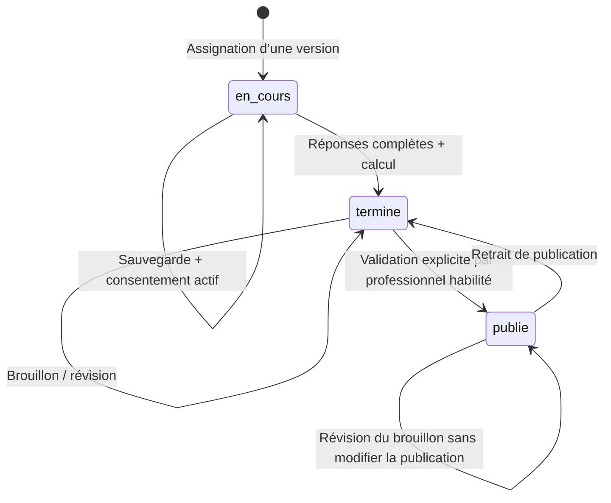

# Architecture et couverture

État documentaire actualisé le 1 octobre 2026 ; audit détaillé dans [SPEC-CONVERGENCE.md](SPEC-CONVERGENCE.md). Les validations historiques restent datées ci-dessous.

## Périmètre

Le document d’audit est utilisé comme description des besoins, pas comme une source de commandes à exécuter. L’application est reconstruite avec Laravel ; aucun ancien code Base44 ni aucune donnée personnelle historique n’a été importé.

Interface Blade responsive, assets locaux sans CDN, sessions Laravel et contrôleurs serveur. `TenantModel` applique un scope de cabinet aux objets métier. En requête web sans identité, ce scope ne retourne aucune donnée. Les commandes d’administration sont locales et ne passent pas par une API publique.

## Droits

| Fonction | Administrateur | Psychologue | Conseiller | Patient | Entreprise |
|---|---|---|---|---|---|
| Dossiers du cabinet, assignation | Oui | Oui | Oui | Son dossier en lecture | Non |
| Notes cliniques | Oui | Oui | Non | Non | Non |
| Réponses / résultats non publiés | Oui | Oui | Oui | Ses réponses ; scores après publication | Non |
| Modifier sa passation en cours | Non | Non | Non | Oui avec consentement | Non |
| Réviser / publier / dépublier | Oui | Oui | Non | Non | Non |
| Créer une version de questionnaire | Oui | Oui | Non | Non | Non |
| Messages | Ses échanges | Ses échanges | Ses échanges | Avec les professionnels | Avec les professionnels |
| Documents | Cabinet | Cabinet | Cabinet | Ceux partagés avec lui | Ceux partagés avec son organisation |
| Espace de travail | Personnel | Personnel | Personnel | Non | Non |
| Comptes et identité cabinet | Oui | Non | Non | Non | Non |

L’administrateur a ici un rôle métier de responsable du cabinet : il dispose donc de l’accès clinique. Créer un rôle d’administrateur purement technique nécessiterait une politique distincte. Aucun dossier n’est automatiquement associé à un compte par simple rapprochement d’e-mail.

Les employés d’une organisation ne donnent **pas** accès à leurs évaluations au portail entreprise. Un document d’entreprise doit être rattaché uniquement à l’organisation, sans `client_id`.

## Modèle

- `Tenant`, `User`, `Organization`, `Client` : cabinet, identités d’accès, partenaires, dossiers.
- `UserInvitation`, `LocalMail`, `PrivacyRequest` : invitations à usage unique, boîte de test chiffrée, demandes et réponses relatives aux droits.
- `Consent` : texte, version, acceptation, retrait. Le retrait ne supprime pas les données historiques.
- `AssessmentDefinition` : famille UUID, version, type, questions, dimensions et règles associées, version de moteur.
- `Assessment` : référence à une ligne de définition versionnée, réponses et résultat instantané chiffrés, dates et statut. Le parcours HTTP crée de nouvelles versions ; le modèle/base ne bloque pas une mise à jour interne de la ligne historique.
- `Interpretation` : draft courant, published_content validé/publié et ai_generations chiffré séparé. Chaque nouvelle génération conserve sa sortie originale intégrale, ses messages d’entrée et métadonnées ; une révision humaine ou régénération ne remplace plus l’original. Les anciennes sorties non conservées restent inconnues.
- `ClinicalNote`, `Appointment`, `Message`, `Document`, `Letter`, `WorkspaceDocument`, `Comparison`, `AuditLog` : suivi et traçabilité.

Les évaluations Gordon/Ennéagramme, tests personnalisés et questionnaires de besoins sont unifiés dans le modèle versionné. Les dimensions et scores sont des structures JSON versionnées dans la définition et le résultat ; ils ne sont pas dupliqués dans des tables `Dimension` ou `Score` séparées.

Clés étrangères et restrictions de suppression en base. Le scope cabinet et les contrôles de propriété s’exécutent côté Laravel : il ne s’agit **pas** de RLS native MySQL. L’archivage est réversible et désactive le compte patient. L’effacement définitif des contenus et l’anonymisation sont réservés à l’administrateur, après vérification du délai, de l’activité, des suspensions et d’une double confirmation.

## Transitions

La soumission verrouille le dossier et la passation dans une transaction ; le retrait de consentement verrouille le même dossier. Les sauvegardes navigateur sont sérialisées et attendues avant soumission. Une soumission répétée ou tardive reçoit HTTP 409. Aucun rôle ne contourne le verrouillage par la route de réponses : une nouvelle assignation conserve l’historique.

## Confidentialité

- Réponses, résultats, notes, messages, courriers, brouillons, comparaisons et fichiers chiffrés avec la clé d’application Laravel.
- Identité et coordonnées restent en clair en base pour le CRM ; archives de sauvegarde chiffrées par secretstream XChaCha20-Poly1305, clé distincte de l’APP_KEY. Le chiffrement du disque et une copie hors machine restent à organiser selon l’hébergement.
- Sessions chiffrées, cookie HttpOnly/SameSite, CSRF, limitation des tentatives de connexion, invalidation logique des comptes désactivés à chaque requête.
- HTML échappé par Blade. Markdown publié avec suppression du HTML brut et refus des liens dangereux.
- Fichiers sous `storage/app/private/vault`, noms de stockage aléatoires ; limites de type et taille. Téléchargement forcé, signature de cinq minutes et contrôle de rôle/propriété même avec la signature.
- Journal des consultations de dossiers et évaluations, mutations principales et téléchargements ; aucune réponse clinique enregistrée dans le journal. Ce journal applicatif n’est pas un journal inviolable externe.
- La publication copie le brouillon validé dans un champ distinct. Les modifications suivantes restent privées jusqu’à une nouvelle publication.

## Couverture et limites explicites

| Domaine de l’audit | Livraison |
|---|---|
| CRM, portails, questionnaires, suivi, consentement | Parcours opérationnels décrits dans le README |
| Gordon | Moteur et validation de grille opérationnels ; référentiel réel à importer |
| Ennéagramme / besoins | Structures opérationnelles ; textes originaux absents, démos étiquetées |
| IA d’interprétation | Adaptateur optionnel, appels simulés dans les tests ; intégration avec un fournisseur réel non validée |
| IA comparateur / conception / courriers | Travail manuel disponible ; automatisations IA spécialisées non implémentées |
| Graphiques | Barres, radars individuels/comparatifs et courbes chronologiques ; historique patient limité aux restitutions publiées |
| PDF individuel, courrier, comparaison | Exports réels avec identité et logo JPEG du cabinet, graphiques selon le rapport |
| Logo, pièces jointes aux courriers | Logo JPEG privé chiffré ; sélection de documents du même patient, PDF et annexes en ZIP |
| Google/Outlook, e-mail externe | Agenda et messagerie internes ; boîte locale de test opérationnelle pour les accès, SMTP à configurer plus tard selon le choix utilisateur. Aucune synchronisation calendrier externe |
| Conservation | Demandes, réponses, export, examen des activités, suspensions motivées et effacement confirmé des dossiers archivés éligibles |
| Sauvegardes et hébergement local | MySQL système, démarrage automatique, sauvegardes chiffrées quotidiennes et restauration testée ; copie hors machine à prévoir |
| Référentiels et validation clinique | Import prêt ; textes et autorisations authentiques restent à fournir par le cabinet |

Les restaurations de dossier ne réactivent pas silencieusement un accès : l’administrateur décide de réactiver le compte. La création de comptes, l’activation/désactivation, l’édition de rôle, les invitations et la récupération du mot de passe sont disponibles. Les messages d’accès passent par la boîte locale privée ; aucun fournisseur réel n’est configuré. Les sessions sont révoquées après modification des droits ou du mot de passe.

## Installation locale et hébergement Render + Aiven

Deux bases distinctes existent ; aucune synchronisation n’est implémentée :

- **Locale** : `.env` conserve MySQL système et les données de la démonstration. La préparation Aiven n’a pas remplacé cette configuration.
- **Aiven** : `.env.aiven` permet les opérations depuis cette machine sur MySQL distant. Les cinq migrations ont été appliquées : 28 tables. Le 29 septembre, un contrôle en lecture seule avec vérification du certificat TLS constate un cabinet, un compte utilisateur et aucun dossier patient. L’utilisateur a exécuté `cabinet:install --env=aiven` et signalé sa réussite. Le passage de relais utilisateur confirme ensuite une authentification administrateur et un tableau de bord fonctionnels en production ; ces deux actions n’ont pas été rejouées par l’agent.

Les paramètres `.env`, `.env.aiven`, `.env.render` et le certificat sous `storage/app/private` sont exclus de Git ; les fichiers d’environnement et fichiers privés sont aussi exclus du contexte Docker. Aucune clé ni aucun mot de passe ne doit être ajouté aux documents ou au dépôt. La clé APP_KEY préparée pour Render est conservée pour permettre le déchiffrement ; elle n’est pas régénérée au démarrage.

### Ce qui est implémenté pour Render

- `render.yaml` décrit un service web Docker, plan `free`, branche `main`, région `frankfurt`, contrôle de santé `/up` et paramètres secrets à renseigner.
- `docker/entrypoint.sh` adapte Apache à `PORT`, utilise `RENDER_EXTERNAL_URL` lorsque `APP_URL` est absent et décode `AIVEN_CA_BASE64` dans un fichier privé. Il vérifie que le certificat est lisible et fournit son chemin à PDO via `MYSQL_ATTR_SSL_CA`.
- La configuration prévoit des sessions chiffrées en base, un cookie sécurisé, le cache en base et les journaux sur stderr. L’IA est désactivée dans le Blueprint.
- Les migrations et la création du cabinet restent des opérations explicites. Aucun import de dossiers locaux ni création de comptes de démonstration n’est effectué au démarrage du conteneur.

### État du déploiement vérifié le 29 septembre 2026

Le site [Render](https://app-007-psychoevaluation.onrender.com) répond : `/up` et `/connexion` renvoient HTTP 200, et `/` conduit à la connexion. Les fichiers `/assets/app.css` et `/assets/app.js` sont accessibles en HTTPS (HTTP 200) et leurs empreintes correspondent aux fichiers du dépôt. La page publique référence la CSS par un chemin relatif, résolu en HTTPS. Elle ne charge pas le JavaScript du tableau de bord : son exécution et le HTML authentifié en production restent à contrôler dans un navigateur.

Le relais utilisateur confirme le déploiement, la connexion Render → Aiven chiffrée après remplacement du certificat CA, puis la connexion administrateur et le tableau de bord. Le certificat local a l’empreinte SHA-256 PEM annoncée dans ce relais. Ces contrôles manuels sont distingués des requêtes publiques et tests locaux exécutés par l’agent. La branche GitHub `main` a été vérifiée à `d277679` avant le présent nettoyage. L’image Docker n’a pas été reconstruite localement.

La correction `trustProxies(at: '*')` dans `bootstrap/app.php` est conservée. [Laravel 13 documente cette configuration](https://laravel.com/docs/13.x/requests#configuring-trusted-proxies) pour les proxys cloud dont les adresses ne sont pas connues ; [Render termine le TLS et transmet en HTTP](https://render.com/docs/web-services#connecting-from-the-public-internet). Les en-têtes transmis permettent à Laravel de reconnaître HTTPS. Les tests simulent cette traversée pour le tableau de bord et un téléchargement signé, et couvrent aussi HTTP local. Le joker suppose une entrée réseau de confiance ; il ne protège pas un serveur d’origine exposé directement à des en-têtes transmis arbitraires. Cette configuration est à réexaminer en cas de changement d’hébergement.

Le bloc temporaire `RENDER TLS DIAGNOSTIC` est retiré de l’entrypoint. Le décodage du CA, sa validation OpenSSL et `MYSQL_ATTR_SSL_CA` sont conservés. Aucune configuration TLS Aiven ni architecture fonctionnelle n’est modifiée.

**Historique du cookie :** `Secure` manquait lors du contrôle du 29 septembre. Après modification utilisateur, le diagnostic HTTP suivant a confirmé cet attribut actif. Le Blueprint seul ne prouve pas la configuration effective d’un service créé manuellement.

### Ce qui reste pour valider complètement la production

1. **Configuration et recette** : conserver l’attribut `Secure` constaté, contrôler les paramètres effectifs Render (`APP_ENV=production`, `APP_DEBUG=false`, `APP_URL` HTTPS), puis vérifier les assets du tableau de bord connecté, les sessions, permissions, PDF et liens signés sur le site. Le nettoyage de l’entrypoint doit encore être publié et déployé.
2. **Documents persistants** : choisir et intégrer un stockage privé durable. Les opérations documentaires utilisent encore `Storage::disk('local')` ; la configuration S3 seule ne constitue pas une intégration. Render gratuit ne conserve pas les fichiers locaux aux redémarrages. Ne pas y déposer de documents à conserver dans cet état.
3. **Exploitation distante** : définir et tester la sauvegarde/restauration de la base Aiven, du futur stockage documentaire et des clés. La crontab locale sauvegarde la base définie dans `.env`, pas automatiquement celle de `.env.aiven`. Aucun planificateur ni worker distant n’est attesté.
4. **Recette visuelle** : contrôler les parcours ordinateur/mobile et l’auto-sauvegarde dans un navigateur ; aucun test E2E ni test de charge réalisé.
5. **Questionnaires réels** : obtenir les textes, grilles et autorisations nécessaires puis valider leur import. Les contenus de démonstration ne sont pas des référentiels validés.

### Éléments reportés ou non implémentés

- Fournisseur IA réel et aides IA spécialisées aux courriers, comparaisons et questions : activation reportée pendant la préparation de l’hébergement.
- E-mails externes : configuration reportée par l’utilisateur. La boîte de test est limitée à local/testing ; elle ne fonctionnera pas avec `APP_ENV=production`. Le transport SMTP générique existe mais n’a pas été testé avec un fournisseur et les restrictions réseau de Render gratuit nécessitent une solution adaptée.
- Synchronisation Google/Outlook et synchronisation des bases locale/distante : non implémentées.
- Copie des sauvegardes hors machine, audit externe et validation clinique : non réalisés. Les tests techniques ne constituent pas une certification.

## Écarts de convergence observés le 1 octobre 2026

Le Spec Kit 001–018 a été retrouvé dans une copie externe identifiée dans [SPEC-CONVERGENCE.md](SPEC-CONVERGENCE.md), pas dans le dépôt Laravel. [ROADMAP.md](../ROADMAP.md) et [TRACEABILITY.md](../TRACEABILITY.md) sont établis à partir du code, des tâches source et des tests existants. Aucun comportement fonctionnel changé.

- Organisations : création/lecture ; édition et suppression non implémentées. Notes cliniques : création/lecture ; édition/suppression individuelle absentes, hors effacement global du dossier.
- Ennéagramme : neuf échelles auto-déclarées, sans migration/lecture des deux structures historiques ni sélection de type dominant ; décisions et sources métier manquantes.
- Besoins : démo 5 domaines + 22 échelles, sans explications/cas spécifiques par situation ; schéma générique personnalisable, pas référentiel validé.
- Portail patient : seules les six dernières passations sont affichées au dashboard, sans liste complète accessible au patient. Les URLs connues conservent leur contrôle de propriété.
- Audit : créations, dossiers consultés, publications et opérations documentaires couverts ; authentification, acceptation/renvoi d’invitation et changement de mot de passe n’émettent pas tous un événement métier. La nouvelle suite 009 vérifie l’audit de génération IA ; les autres événements restent sans assertions dédiées.
- Rétention : mécanique de dossier Client testée, mais décision métier de durée et conservation des documents entreprise/non rattachés non attestées. Le journal n’est pas inviolable ; l’audit de convergence ne constitue pas un audit externe de sécurité.

Disponibilité : après l’incident Aiven `Powered off` rapporté le 1 octobre, `/up`, `/connexion` et les deux assets répondent à nouveau HTTP 200 pendant l’audit. `/up` peut réussir même si la base est indisponible. Aucune authentification administrateur ni vérification TLS Render → Aiven rejouée dans cette mission ; les validations antérieures restent des preuves historiques, pas une garantie de disponibilité continue.

## Feature 009 — historique des générations IA

Correction ciblée depuis la baseline e71138c, sans changement des méthodes de révision/publication 010. Une colonne nullable LONGTEXT ajoutée par `2026_10_01_160120_add_ai_generations_to_interpretations_table.php` est castée encrypted:array dans Interpretation et exclue de sa sérialisation générique. Aucun nouveau modèle, relation ou endpoint.

Chaque génération réussie ajoute UUID, date d’enregistrement, demandeur, contenu original, modèle demandé/retourné si disponible, identifiant réponse si disponible, version du prompt, messages exacts envoyés et snapshot expurgé des réponses libres. Aucune clé API ou configuration secrète n’est copiée. Le verrou transactionnel Assessment existant sérialise les écritures ; l’audit interpretation.generee reste dans la même transaction. Le brouillon conserve sa limite de 50000 caractères, l’original reste intégral.

La régénération garde le comportement existant de remplacement du brouillon courant ; elle ajoute son original à l’historique sans changer la publication, sa date ou son validateur. La spec ne définit pas davantage de politique métier : pas d’historique de toutes les éditions humaines, pas de nouvelle durée de rétention et pas de restauration automatique d’un brouillon. La suppression de l’Interpretation par Retention supprime également cet historique. La liste chiffrée est adaptée au périmètre actuel ; elle croît avec les générations et n’est pas un journal SQL inviolable.

Une section de lecture échappée dans l’évaluation est réservée aux admin/psychologues. Les portails patient/entreprise, le conseiller et les exports patient ne reçoivent pas cet historique. Aucun score ni règle psychométrique n’est modifié.

Données anciennes : aucune copie du draft vers un prétendu original. Colonne null jusqu’à une génération effectivement enregistrée. Migration testée sur une ligne préexistante SQLite, pas appliquée à Aiven ; à appliquer via le processus de déploiement avant utilisation de la génération mise à jour. Un rollback de cette migration détruirait uniquement la nouvelle colonne et son historique : conserver le schéma et les données pour un retour de code, ne pas lancer un rollback de données sans sauvegarde.

Statut 009 PARTIAL : workflow interne testé avec réponses simulées ; **fournisseur OpenAI réel NON TESTÉ / BLOQUÉ faute de crédits API**. Aucune clé demandée, aucun appel IA réel. Validation fournisseur ultérieure séparée, hors suite automatisée gratuite.
