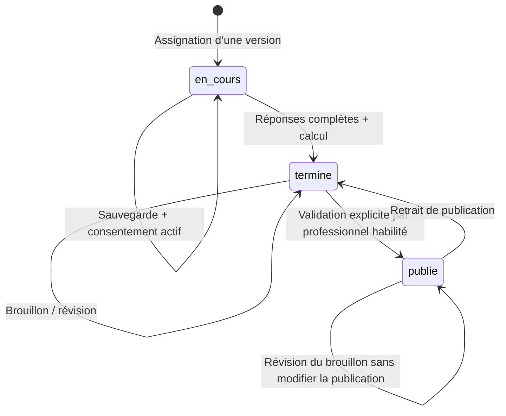

# Architecture et couverture

## Périmètre

Le document d’audit est utilisé comme description des besoins, pas comme une source de commandes à exécuter. L’application est reconstruite avec Laravel ; aucun ancien code Base44 ni aucune donnée personnelle historique n’a été importé.

Interface Blade responsive, assets locaux sans CDN, sessions Laravel et contrôleurs serveur. `TenantModel` applique un scope de cabinet aux objets métier. En requête web sans identité, ce scope ne retourne aucune donnée. Les commandes d’administration sont locales et ne passent pas par une API publique.

## Droits

| Fonction | Administrateur | Psychologue | Conseiller | Patient | Entreprise |
|---|---|---|---|---|---|
| Dossiers du cabinet, assignation | Oui | Oui | Oui | Son dossier en lecture | Non |
| Notes cliniques | Oui | Oui | Non | Non | Non |
| Réponses / résultats non publiés | Oui | Oui | Oui | Ses réponses ; scores après publication | Non |
| Modifier sa passation en cours | Non | Non | Non | Oui avec consentement | Non |
| Réviser / publier / dépublier | Oui | Oui | Non | Non | Non |
| Créer une version de questionnaire | Oui | Oui | Non | Non | Non |
| Messages | Ses échanges | Ses échanges | Ses échanges | Avec les professionnels | Avec les professionnels |
| Documents | Cabinet | Cabinet | Cabinet | Ceux partagés avec lui | Ceux partagés avec son organisation |
| Espace de travail | Personnel | Personnel | Personnel | Non | Non |
| Comptes et identité cabinet | Oui | Non | Non | Non | Non |

L’administrateur a ici un rôle métier de responsable du cabinet : il dispose donc de l’accès clinique. Créer un rôle d’administrateur purement technique nécessiterait une politique distincte. Aucun dossier n’est automatiquement associé à un compte par simple rapprochement d’e-mail.

Les employés d’une organisation ne donnent **pas** accès à leurs évaluations au portail entreprise. Un document d’entreprise doit être rattaché uniquement à l’organisation, sans `client_id`.

## Modèle

- `Tenant`, `User`, `Organization`, `Client` : cabinet, identités d’accès, partenaires, dossiers.
- `UserInvitation`, `LocalMail`, `PrivacyRequest` : invitations à usage unique, boîte de test chiffrée, demandes et réponses relatives aux droits.
- `Consent` : texte, version, acceptation, retrait. Le retrait ne supprime pas les données historiques.
- `AssessmentDefinition` : famille UUID, version, type, questions, dimensions et règles associées, version de moteur.
- `Assessment` : référence immuable à une version, réponses et résultat instantané chiffrés, dates et statut.
- `Interpretation` : brouillon, source, modèle, prompt, entrée structurée, contenu publié distinct, validateur et date.
- `ClinicalNote`, `Appointment`, `Message`, `Document`, `Letter`, `WorkspaceDocument`, `Comparison`, `AuditLog` : suivi et traçabilité.

Les évaluations Gordon/Ennéagramme, tests personnalisés et questionnaires de besoins sont unifiés dans le modèle versionné. Les dimensions et scores sont des structures JSON versionnées dans la définition et le résultat ; ils ne sont pas dupliqués dans des tables `Dimension` ou `Score` séparées.

Clés étrangères et restrictions de suppression en base. Le scope cabinet et les contrôles de propriété s’exécutent côté Laravel : il ne s’agit **pas** de RLS native MySQL. L’archivage est réversible et désactive le compte patient. L’effacement définitif des contenus et l’anonymisation sont réservés à l’administrateur, après vérification du délai, de l’activité, des suspensions et d’une double confirmation.

## Transitions

La soumission verrouille le dossier et la passation dans une transaction ; le retrait de consentement verrouille le même dossier. Les sauvegardes navigateur sont sérialisées et attendues avant soumission. Une soumission répétée ou tardive reçoit HTTP 409. Aucun rôle ne contourne le verrouillage par la route de réponses : une nouvelle assignation conserve l’historique.

## Confidentialité

- Réponses, résultats, notes, messages, courriers, brouillons, comparaisons et fichiers chiffrés avec la clé d’application Laravel.
- Identité et coordonnées restent en clair en base pour le CRM ; archives de sauvegarde chiffrées par secretstream XChaCha20-Poly1305, clé distincte de l’APP_KEY. Le chiffrement du disque et une copie hors machine restent à organiser selon l’hébergement.
- Sessions chiffrées, cookie HttpOnly/SameSite, CSRF, limitation des tentatives de connexion, invalidation logique des comptes désactivés à chaque requête.
- HTML échappé par Blade. Markdown publié avec suppression du HTML brut et refus des liens dangereux.
- Fichiers sous `storage/app/private/vault`, noms de stockage aléatoires ; limites de type et taille. Téléchargement forcé, signature de cinq minutes et contrôle de rôle/propriété même avec la signature.
- Journal des consultations de dossiers et évaluations, mutations principales et téléchargements ; aucune réponse clinique enregistrée dans le journal. Ce journal applicatif n’est pas un journal inviolable externe.
- La publication copie le brouillon validé dans un champ distinct. Les modifications suivantes restent privées jusqu’à une nouvelle publication.

## Couverture et limites explicites

| Domaine de l’audit | Livraison |
|---|---|
| CRM, portails, questionnaires, suivi, consentement | Parcours opérationnels décrits dans le README |
| Gordon | Moteur et validation de grille opérationnels ; référentiel réel à importer |
| Ennéagramme / besoins | Structures opérationnelles ; textes originaux absents, démos étiquetées |
| IA d’interprétation | Adaptateur optionnel, tests simulés, pas d’appel réel ni de clé fournie |
| IA comparateur / conception / courriers | Travail manuel disponible ; automatisations IA spécialisées non implémentées |
| Graphiques | Barres, radars individuels/comparatifs et courbes chronologiques ; historique patient limité aux restitutions publiées |
| PDF individuel, courrier, comparaison | Exports réels avec identité et logo JPEG du cabinet, graphiques selon le rapport |
| Logo, pièces jointes aux courriers | Logo JPEG privé chiffré ; sélection de documents du même patient, PDF et annexes en ZIP |
| Google/Outlook, e-mail externe | Agenda et messagerie internes ; boîte locale de test opérationnelle pour les accès, SMTP à configurer plus tard selon le choix utilisateur. Aucune synchronisation calendrier externe |
| Conservation | Demandes, réponses, export, examen des activités, suspensions motivées et effacement confirmé des dossiers archivés éligibles |
| Sauvegardes et hébergement local | MySQL système, démarrage automatique, sauvegardes chiffrées quotidiennes et restauration testée ; copie hors machine à prévoir |
| Référentiels et validation clinique | Import prêt ; textes et autorisations authentiques restent à fournir par le cabinet |

Les restaurations de dossier ne réactivent pas silencieusement un accès : l’administrateur décide de réactiver le compte. La création de comptes, l’activation/désactivation, l’édition de rôle, les invitations et la récupération du mot de passe sont disponibles. Les messages d’accès passent par la boîte locale privée ; aucun fournisseur réel n’est configuré. Les sessions sont révoquées après modification des droits ou du mot de passe.
